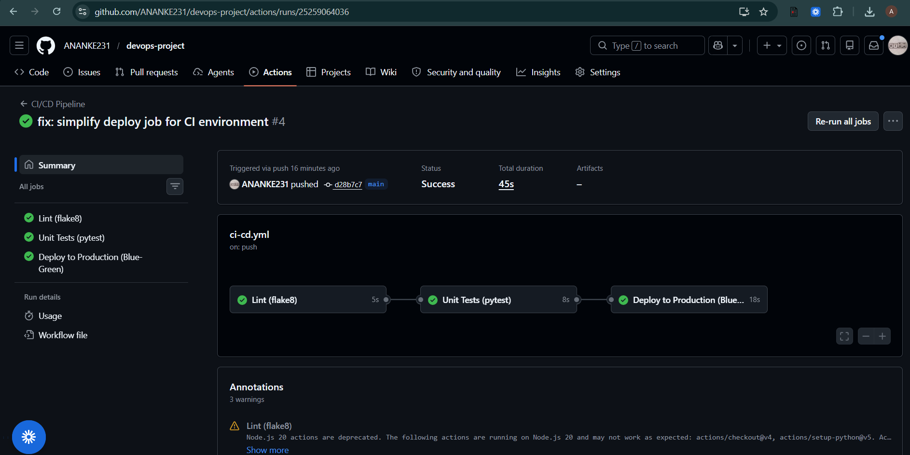
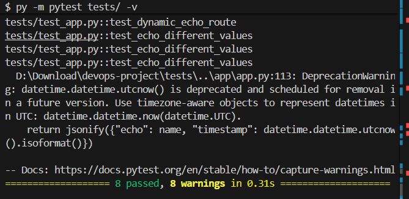
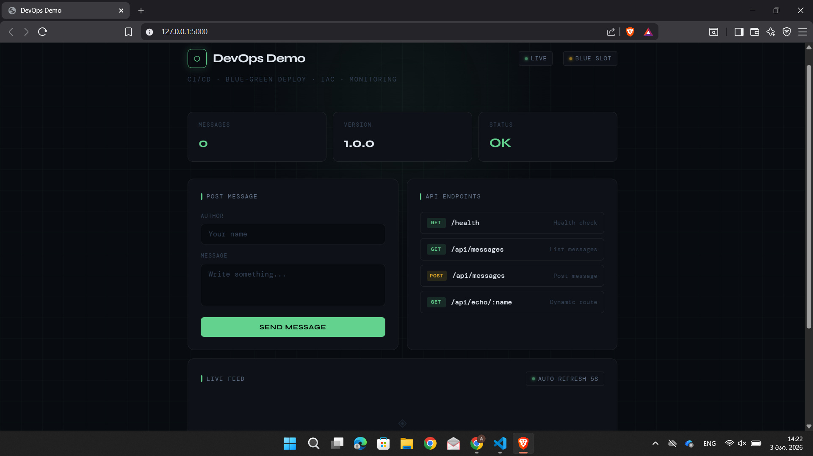
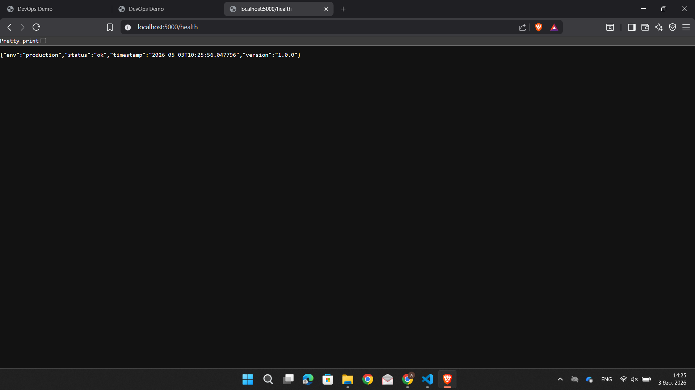

# ⬡ DevOps Demo App

A Python/Flask web app with a full DevOps pipeline — CI/CD, Blue-Green deployment, IaC, and monitoring.

---

## Tech Stack

| | Tool |
|---|---|
| **App** | Python 3.11 · Flask 3.0 |
| **Tests** | pytest · flake8 |
| **CI/CD** | GitHub Actions |
| **IaC** | Ansible · Bash |
| **Deploy** | Blue-Green |
| **Monitor** | Bash health-check script |

---

## Project Structure

```
devops-project/
├── app/app.py                  # Flask app
├── tests/test_app.py           # Unit tests (8 tests)
├── docs/                       # Screenshots
├── .github/workflows/ci-cd.yml # CI/CD pipeline
├── ansible/setup.yml           # IaC playbook
├── scripts/
│   ├── deploy.sh               # Blue-Green deploy
│   ├── rollback.sh             # Rollback
│   └── health_check.sh         # Health monitor
├── setup.sh                    # One-command setup
└── requirements.txt
```

## CI/CD Workflow

```
git push
    │
    ▼
┌─────────┐    ┌─────────┐    ┌──────────────┐
│  LINT   │ →  │  TEST   │ →  │    DEPLOY    │
│ flake8  │    │ pytest  │    │ (main only)  │
└─────────┘    └─────────┘    └──────┬───────┘
                                     │
                          ┌──────────┴──────────┐
                          │                     │
                     ┌────▼────┐          ┌─────▼───┐
                     │  BLUE   │          │  GREEN  │
                     │  :5001  │          │  :5002  │
                     └─────────┘          └─────────┘
```

- `main` → lint + test + deploy
- `dev` → lint + test only

---

## Setup

**One command (Bash):**
```bash
bash setup.sh
```

**Or with Ansible:**
```bash
pip install ansible
ansible-playbook -i ansible/inventory.ini ansible/setup.yml
```

---

## Run Locally

```bash
pip install -r requirements.txt
py app/app.py
# Visit http://localhost:5000
```

---

## API

| Method | Endpoint | Description |
|---|---|---|
| GET | `/` | Web UI |
| GET | `/health` | Health check |
| GET | `/api/messages` | List messages |
| POST | `/api/messages` | Post message |
| GET | `/api/echo/<name>` | Dynamic route |

---

## Deploy & Rollback

```bash
# Deploy new version
bash scripts/deploy.sh v2.0

# Rollback instantly
bash scripts/rollback.sh
```

---

## Health Monitoring

```bash
# One-time check
bash scripts/health_check.sh

# Continuous (every 30s)
bash scripts/health_check.sh --watch
```

---

## Screenshots

### CI/CD Pipeline


### Unit Tests


### Running App


### Health Check
